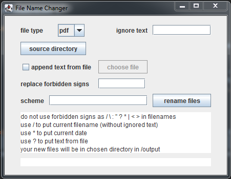
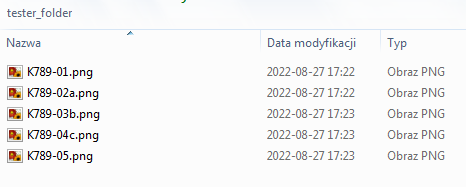
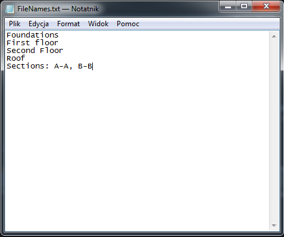
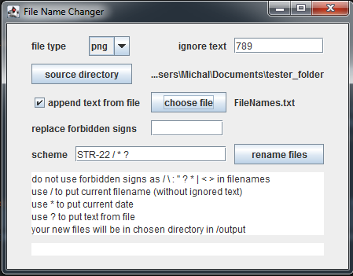
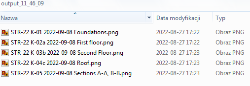

## FILENAME CHANGER

Aplikacja do zmiany nazw plików

Application for changing filenames

### OPIS APLIKACJI

Aplikacja do zmiany nazw plików generowanych w pracowniach
projektowych z programów typu CAD.

#### OPIS UŻYTKOWANIA

Aplikacja wymaga wybrania folderu zawierającego pliki,
których nazwy mają zostać zmienione. Opcjonalnie wpisać można
tekst ze starej nazwy, który powinien zostać pominięty
w procesie tworzenia nowej nazwy. 

Aplikacja pozwala także wybrać plik .txt z bazą nazw, 
które mają zostać dołączone.

Należy zadbać, aby ilość linijek nowych nazw w pliku .txt 
odpowiadała ilości plików zmienianych. Pozwala to uniknąć 
pomyłek i nieprawidłowych przypisań tytułów rysunków do plików.

Aplikacja pobiera pliki z folderu i układa je nazwami rosnąco.
Należy zwrócić na to szczególną uwagę, jeżeli jeden rysunek 
jest rozszerzeniem innego (np. rys. K-5.1 jest rozszerzeniem 
rysunku K-5 i będzie występował wyżej w folderze).
W takiej kolejności zostaną nadane nazwy z pliku .txt 
(plik tekstowy utworzyć przez przekopiowanie kolumny 
zestawienia rysunków zawierającej wyłącznie nazwy rysunków).

Aplikacja pozwala wybrać maksymalnie 2 znaki, którymi zostaną
zastąpione znaki niedozwolone w nazwach plików (domyślnie
znaki te są usuwane).

Nową nazwę tworzy się poprzez wpisanie w odpowiednie pole
schematu nowej nazwy zgodnie z instrukcją zamieszczoną
w aplikacji.

### APPLICATION DESCRIPTION

Application for renaming files generating in
design offices from CAD programs.

#### DESCRIPTION OF USE

The application requires to select a folder containing 
files, whose names are to be changed. You can optionally enter
text from the old name that should be omitted
in the process of creating a new filename.

The application also allows you to select a .txt file with 
a name base, that should be attached.

Make sure that the number of lines of new names in the .txt 
file corresponds to the number of changing files. That lets 
avoid mistakes and incorrect assignments of drawing 
titles to files.

The application getting files from the folder and 
sorting them with the names in ascending order.
Pay special attention to this if one drawing
is an extension of another (e.g. fig. K-5.1 is an extension of
fig. K-5 and will appear higher in the folder).
The names in the .txt file will be given in this 
order (create the text file by copying the column a list 
of drawings containing only the names of the drawings).

The application allows you to choose up to 2 characters to be
replaced by characters not allowed in filenames (default
these characters are removed).

A new name is created by entering it in the scheme field
of the new name according to the instructions included
in the app.

### SCREENSHOTS

